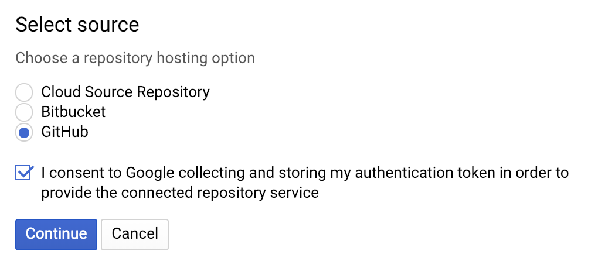
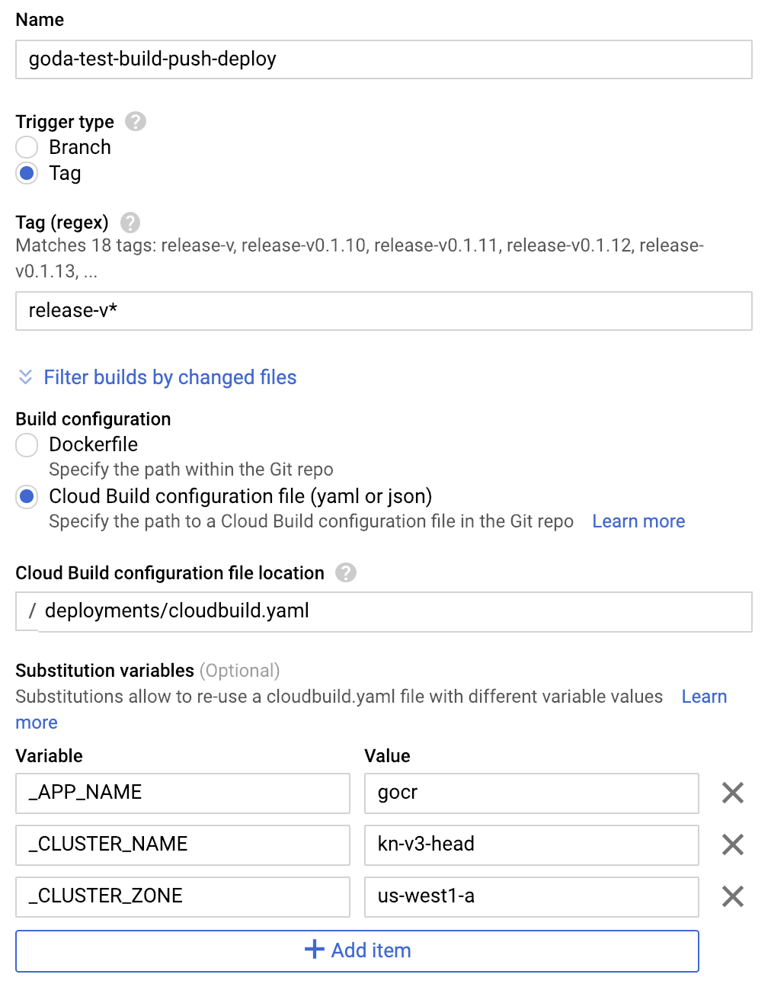

# knative-gitops-using-cloud-build

> GitOps demo using Cloud Build and Knative

Simple setup to automate Knative deployment using Cloud Build by git tags.

* Commit code to your repo (run unit tests)
* When happy tag the commit you want to deploy
* Cloud Build then:
  * Tests (again)
  * Builds and tags image
  * Pushes that image to repository
  * Creates Knative service manifest
  * Applies that manifest to designated Knative cluster

## Setup

You will have to [configure git trigger](https://pantheon.corp.google.com/cloud-build/triggers/add) in Cloud Build first. There doesn't seem to be a way to do this using `gcloud`.



Then setup IAM policy binding to allow Cloud Builder deploy build image to your cluster

```shell
PROJECT_NUMBER="$(gcloud projects describe ${PROJECT_ID} --format='get(projectNumber)')"
gcloud projects add-iam-policy-binding ${PROJECT_NUMBER} \
    --member=serviceAccount:${PROJECT_NUMBER}@cloudbuild.gserviceaccount.com \
    --role=roles/container.developer
```

Finally submit the Cloud Build configuration

```shell
gcloud builds submit --config deployments/cloudbuild.yaml
```



## Deployment

To build and deploy specific commit from git, tag it and publish the tags. We also are going to print the last few tags so we can see the exact commit hash.

```shell
git tag "release-v${RELEASE_VERSION}"
git push origin "release-v${RELEASE_VERSION}"
git log --oneline
```

## Logs

You can monitor progress of your build but first finding its id

```shell
gcloud builds list
```

And then describing it

```shell
gcloud builds describe BUILD_ID
```

You can always also navigate to the [Build History](https://pantheon.corp.google.com/cloud-build/builds?folder=&organizationId=433637338589&project=s9-demo) screen in UI and see it there.

